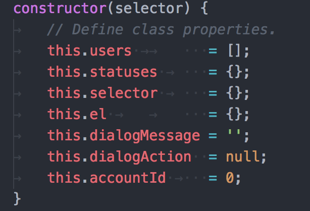
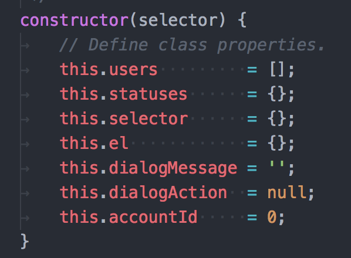

# vscode-inline-spacify README

This allows users to convert tabs to spaces inline for alignment purposes. Simply enable the plugin, then save an open document. All inline tabs will be converted to the proper spacing. (This excludes tabs at the beginning of a line).

## Features
The extension automatically runs on file save which is automatically handled by VS Code
at regular intervals.

> Before (Notice the inline tabs used for alignment):

> After (The inline tabs have been converted to spaces):

The extension can also be executed on demand

- **Mac**: <kbd>Shift</kbd> + <kbd>Command</kbd> + <kbd>Alt</kbd> + <kbd>Space</kbd>
- **Windows**: <kbd>Shift</kbd> + <kbd>Win</kbd> + <kbd>Alt</kbd> + <kbd>Space</kbd>

## Extension Settings

This extension defaults to the tab size of the current document, otherwise falls back to the default tabSize editor setting: `editor.tabSize`

## Release Notes

### 1.0.0

Fix context issue when using keyboard shortcuts.

### 0.0.2

Update icon and keywords.

### 0.0.1

Initial Release!